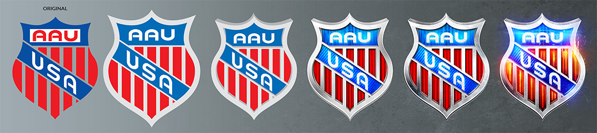
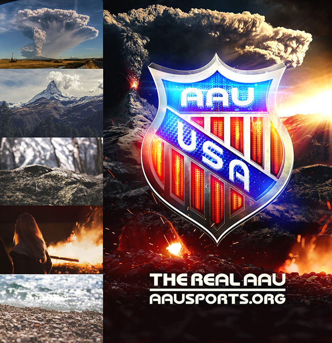
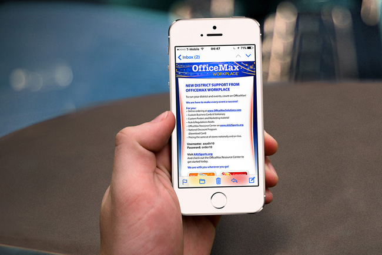
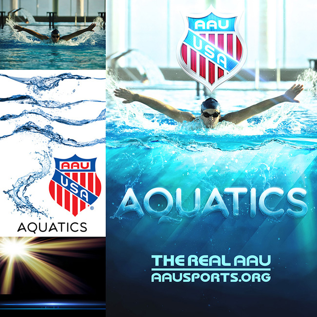
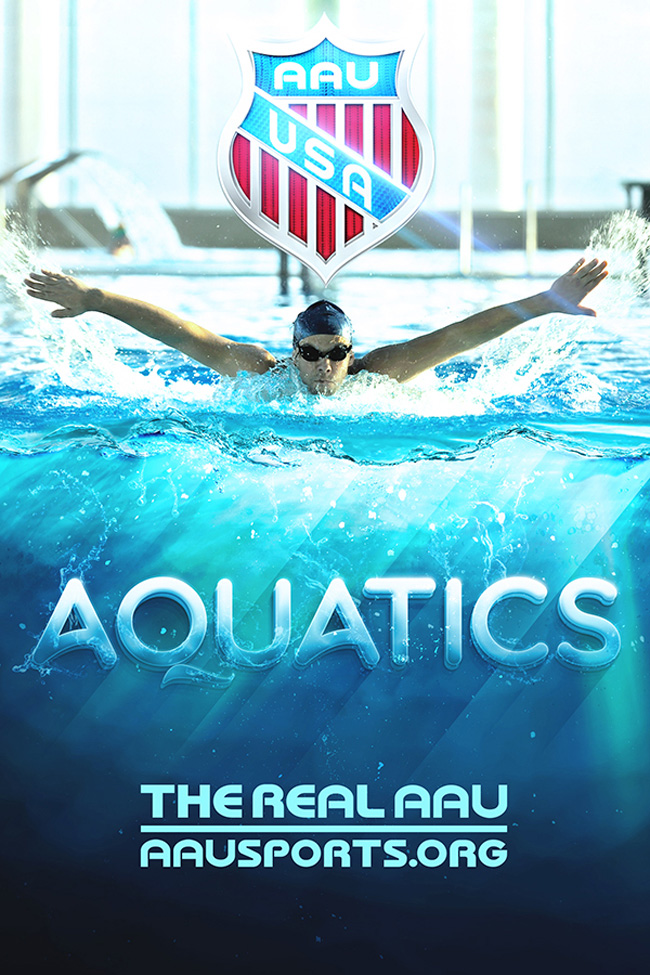
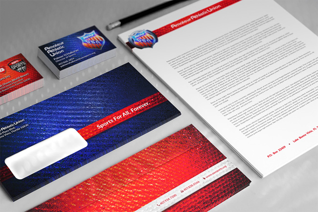
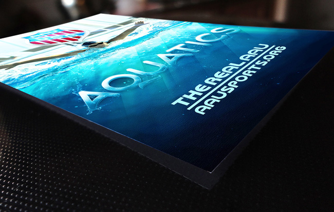
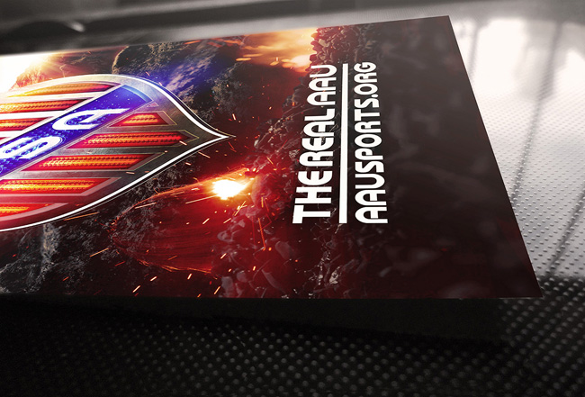
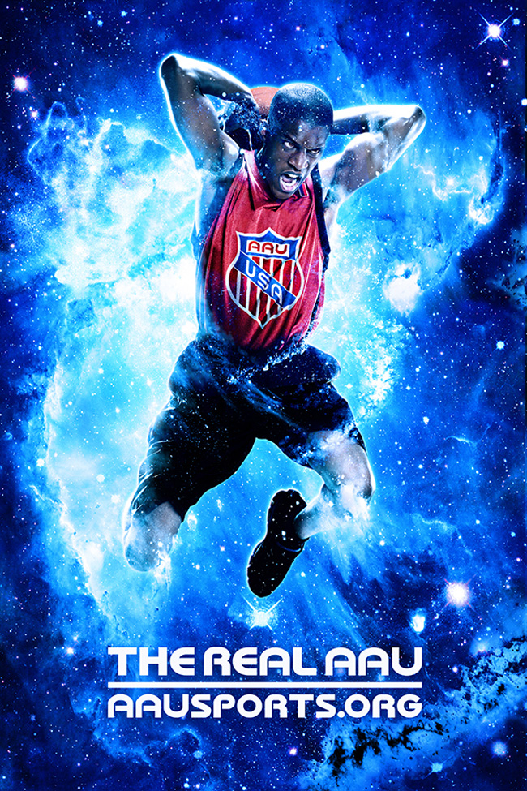
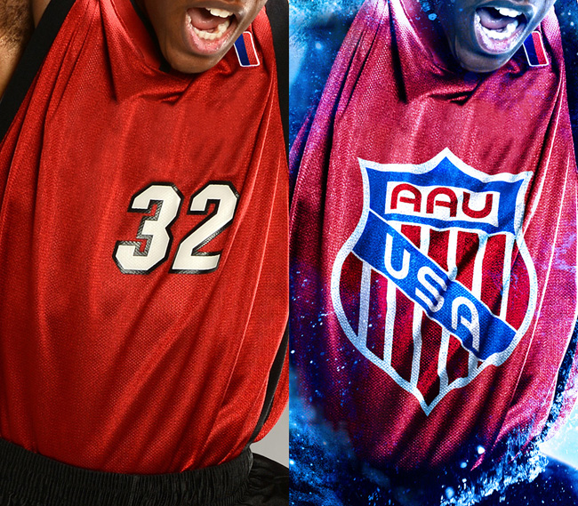

### About AAU

The Amateur Athletic Union, founded in 1888, established standards and uniformity in amateur sports. With over 670,000 participants and over 100,000 volunteers, they've served as an international sports leader for over one hundred years. By supporting all ages at a grass roots level, they spread a philosophy of "Sports for All, Forever."

### Project Overview

While AAU acts as a centralized support organization, the various independent leagues and districts are spread throughout the entire United States. My task was to design marketing materials, to aid them in player recruitment, fund raising and community building. 

Rather than settle for generic designs, our goal was to instead develop items that could be easily customized through an online ordering system, to better connect with each organization's personal events and communities. These items ranged from business cards and stationary, to posters, flyers and brochures, each with customizable text fields.

Common sports marketing campaigns like Nike and Gatorade have a recognizably *extreme* style. This is fitting for the competitive nature of sports and pushing one's self to achieve greatness. While the AAU may be primarily an amateur league, my goal was to create items that would help share that recognizable "big league" style.

	<figure itemprop="associatedMedia" itemscope itemtype="http://schema.org/ImageObject" class="masonry-item project-gallery-item full gallery-item_aau-shield">
		
		<figcaption itemprop="caption description">AAU Shield stylized logo design progression</figcaption>
	</figure>
	<figure itemprop="associatedMedia" itemscope itemtype="http://schema.org/ImageObject" class="masonry-item project-gallery-item large">
		
		<figcaption itemprop="caption description">AAU Shield poster</figcaption>
	</figure>
	<figure itemprop="associatedMedia" itemscope itemtype="http://schema.org/ImageObject" class="masonry-item project-gallery-item narrow">
		
		<figcaption itemprop="caption description">AAU Shield poster photo references and assets</figcaption>
	</figure>
	<figure itemprop="associatedMedia" itemscope itemtype="http://schema.org/ImageObject" class="masonry-item project-gallery-item half">
		
		<figcaption itemprop="caption description">AAU/OfficeMax Sales Portal</figcaption>
	</figure>
	<figure itemprop="associatedMedia" itemscope itemtype="http://schema.org/ImageObject" class="masonry-item project-gallery-item half">
		
		<figcaption itemprop="caption description">AAU/OfficeMax Sales email blast</figcaption>
	</figure>
	<figure itemprop="associatedMedia" itemscope itemtype="http://schema.org/ImageObject" class="masonry-item project-gallery-item narrow">
		
		<figcaption itemprop="caption description">AAU Aquatics sports poster photo references and assets</figcaption>
	</figure>
	<figure itemprop="associatedMedia" itemscope itemtype="http://schema.org/ImageObject" class="masonry-item project-gallery-item large">
		
		<figcaption itemprop="caption description">AAU Aquatics sports poster</figcaption>
	</figure>
	<figure itemprop="associatedMedia" itemscope itemtype="http://schema.org/ImageObject" class="masonry-item project-gallery-item large">
		
		<figcaption itemprop="caption description">AAU Stationary</figcaption>
	</figure>
	<figure itemprop="associatedMedia" itemscope itemtype="http://schema.org/ImageObject" class="masonry-item project-gallery-item small">
		
		<figcaption itemprop="caption description">AAU Aquatics poster printed</figcaption>
	</figure>
	<figure itemprop="associatedMedia" itemscope itemtype="http://schema.org/ImageObject" class="masonry-item project-gallery-item small">
		
		<figcaption itemprop="caption description">AAU Shield poster printed</figcaption>
	</figure>
	<figure itemprop="associatedMedia" itemscope itemtype="http://schema.org/ImageObject" class="masonry-item project-gallery-item small">
		
		<figcaption itemprop="caption description">AAU Basketball poster photo references and assets</figcaption>
	</figure>
	<figure itemprop="associatedMedia" itemscope itemtype="http://schema.org/ImageObject" class="masonry-item project-gallery-item large">
		
		<figcaption itemprop="caption description">AAU Basketball poster</figcaption>
	</figure>
	<figure itemprop="associatedMedia" itemscope itemtype="http://schema.org/ImageObject" class="masonry-item project-gallery-item small">
		
		<figcaption itemprop="caption description">AAU Basketball poster jersey closeup</figcaption>
	</figure>

