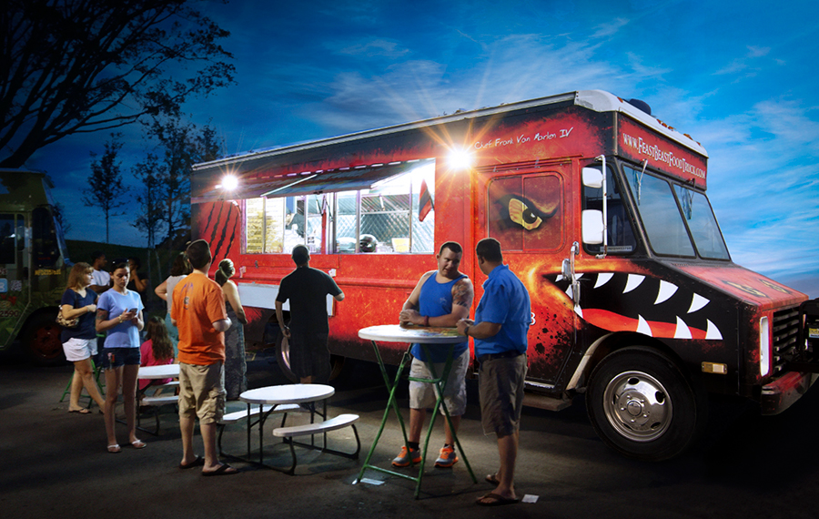
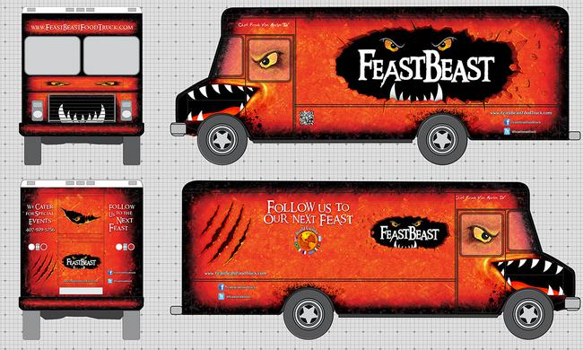
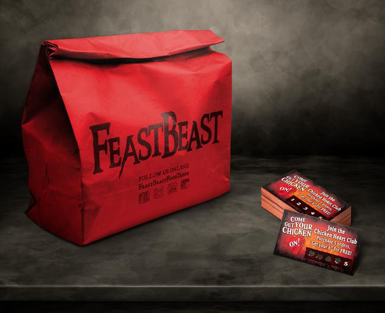
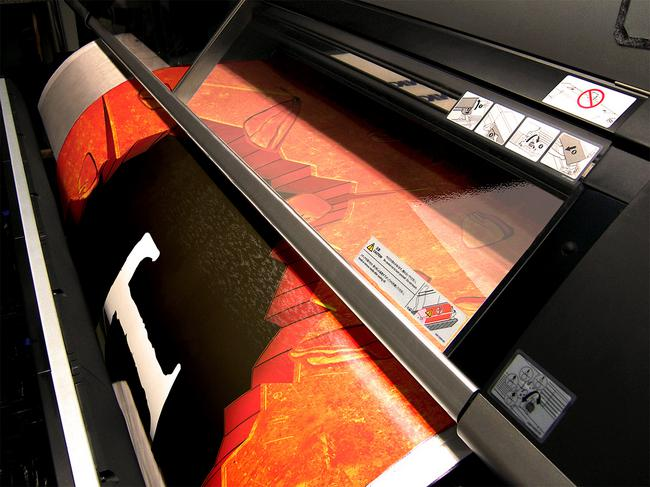

### About FeastBeast

FeastBeast is a food truck serving central Florida. Featuring gourmet dishes prepared by Chef Frank Van Marlen, and inspired by authentic Brazilian culture and cuisine.

### Project Overview

Create a brand that's recognizably unique enough to stand out from the pack, in a rapidly growing and saturated market. The brand needed to be rooted in a foundation that was the truck itself. While the name "FeastBeast" spoke to satisfying the fierce hunger of customers, the central idea behind the brand became giving the truck a literal identity, as the personified "FeastBeast".

### Challenges

#### Stand out.

"Branding" can be an overly generalized cliché in design. But when the majority of business will come from food truck events, where all your competition is there, fighting for attention, presentation really is everything. It was important to create a recognizable identity. Whether parked at an event, driving through the streets, or mentioned on social media - FeastBeast needed to stand out.

#### Designing at large scales can be challenging.

All the intricacies of a large vehicle add even more complexity. Accurate measurements were vital, along with accounting for all details such as lights, doors and windows. It helped working closely with the sign company that would be printing and applying the final vehicle wrap. At over 23 feet long and nearly 8 feet wide, working in high resolutions at these sizes can be taxing on even high-end computers. But it's important to not sacrifice quality, and maximize the capabilities of a printer. To conserve computing resources, it helps to work with artwork scaled down to smaller physical sizes, but higher resolutions. However, this adds to the complexity of the measurements, and needs readjusted before hand off to the printer.

  

    <figure itemprop="associatedMedia" itemscope itemtype="http://schema.org/ImageObject">
      
    </figure>
  

  

    <figure itemprop="associatedMedia" itemscope itemtype="http://schema.org/ImageObject">
      
    </figure>
    <figure itemprop="associatedMedia" itemscope itemtype="http://schema.org/ImageObject">
      
    </figure>
    <figure class="large" itemprop="associatedMedia" itemscope itemtype="http://schema.org/ImageObject">
      
    </figure>
  

