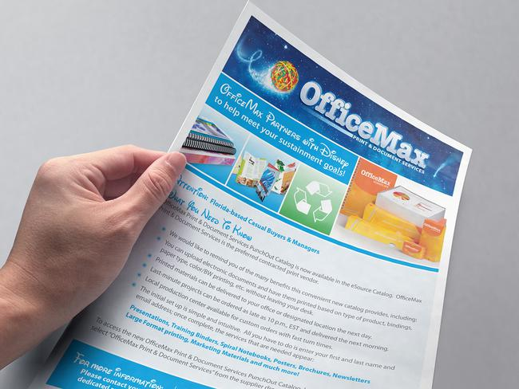
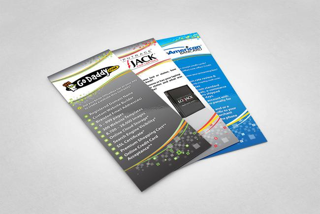
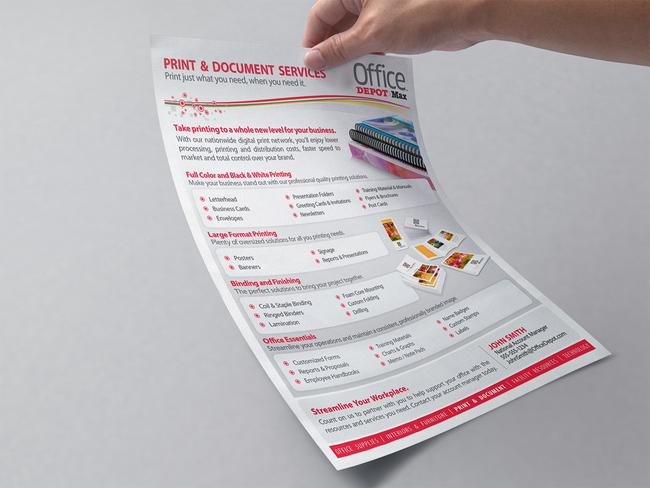
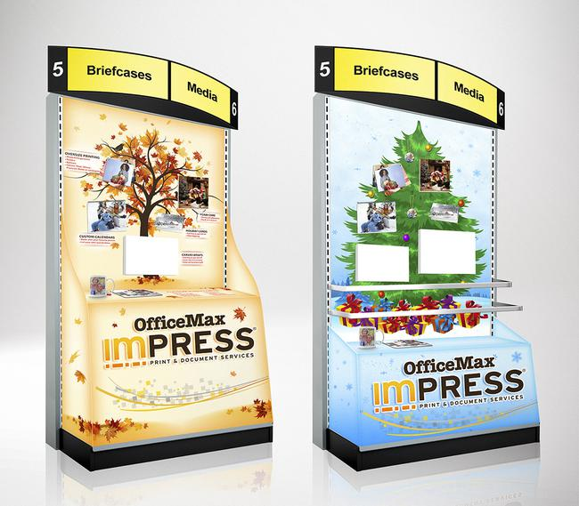

### About OfficeMax

OfficeMax is a North American based office supply retailer. For businesses both small and large, solutions for every facet of business are offered; including print, tech, marketing and business management support.

In 2014 OfficeMax merged with competitor Office Depot.

### Overview

Work with marketing and sales teams to design materials that braught attention to specific offerings outside the blanket “office supplies” umbrella. The end-user ran the gamut from independent entrepreneurs and small businesses, to large state universities, medical facilities, and fortune 500s.

Post OfficeMax / Office Depot merger: Design materials that seamlessly unified both OfficeMax and Office Depot brands.

### Challenges

Know when and how to break the design mold, allowing certain campaigns to stand out from other more consistent marketing. 

Make messages clear and consise; Presentations personably relatable.

Transition new unified Office Depot/Max branding in a way that appeared purposeful and gradually evolutionary - rather than chaotic and unfamiliar.

	<figure itemprop="associatedMedia" itemscope itemtype="http://schema.org/ImageObject" class="masonry-item project-gallery-item large">
		
		<figcaption itemprop="caption description">OfficeMax / Walt Disney partnership flyer</figcaption>
	</figure>
	<figure itemprop="associatedMedia" itemscope itemtype="http://schema.org/ImageObject" class="masonry-item project-gallery-item small">
		
		<figcaption itemprop="caption description">OfficeMax rewards program flyer</figcaption>
	</figure>
	<figure itemprop="associatedMedia" itemscope itemtype="http://schema.org/ImageObject" class="masonry-item project-gallery-item small">
		
		<figcaption itemprop="caption description">OfficeMax sales collateral rack cards</figcaption>
	</figure>
	<figure itemprop="associatedMedia" itemscope itemtype="http://schema.org/ImageObject" class="masonry-item project-gallery-item full gallery-item_officemax-disney">
		
		<figcaption itemprop="caption description">OfficeMax / Walt Disney partnership logo</figcaption>
	</figure>
	<figure itemprop="associatedMedia" itemscope itemtype="http://schema.org/ImageObject" class="masonry-item project-gallery-item half">
		
		<figcaption itemprop="caption description">Office Depot print sales canvassing flyer</figcaption>
	</figure>
	<figure itemprop="associatedMedia" itemscope itemtype="http://schema.org/ImageObject" class="masonry-item project-gallery-item half">
		
		<figcaption itemprop="caption description">OfficeMax seasonal merchandising displays</figcaption>
	</figure>

