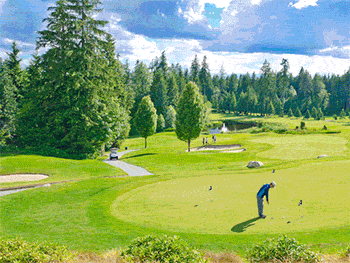

### About the PGA

The Professional Golfer’s Association of America (PGA) is the largest working sports organization in the world, comprised of more than 27,000 dedicated supporters promoting the game of golf to everyone, everywhere.

### Project Overview

Design a holiday card that captures the spirits of enjoying both golf and the holidays. My concept was to show a golf scene under a light winter's snow. The holidays are a time to enjoy the things you love with the ones you love - in this case, playing golf (come rain or shine, or even snow...).

### Challenges

To fully capture the golf 'winter wonderland' scene that was pictured in my mind, a full photo composite was needed. Various elements were combined from 4 primary stock photos to create the final scene and mood. This also included realisticly imposing the PGA logo onto a golf ball, indended for the main focal point.

  

    <figure class="tall" itemprop="associatedMedia" itemscope itemtype="http://schema.org/ImageObject">
      
    </figure>
    <figure class="large" itemprop="associatedMedia" itemscope itemtype="http://schema.org/ImageObject">
      
    </figure>
  

  

    <figure class="tall" itemprop="associatedMedia" itemscope itemtype="http://schema.org/ImageObject">
      
    </figure>
    <!--<figure itemprop="associatedMedia" itemscope itemtype="http://schema.org/ImageObject">
      
    </figure>-->
    <figure class="large left" itemprop="associatedMedia" itemscope itemtype="http://schema.org/ImageObject">
      
    </figure>
  

  

    <!-- Copy & Pasted from YouTube -->
      <iframe src="https://player.vimeo.com/video/137291395?color=2ECEF1&byline=0&portrait=0" id="pga-process" width="500" height="664" frameborder="0" webkitallowfullscreen mozallowfullscreen allowfullscreen></iframe>
  

