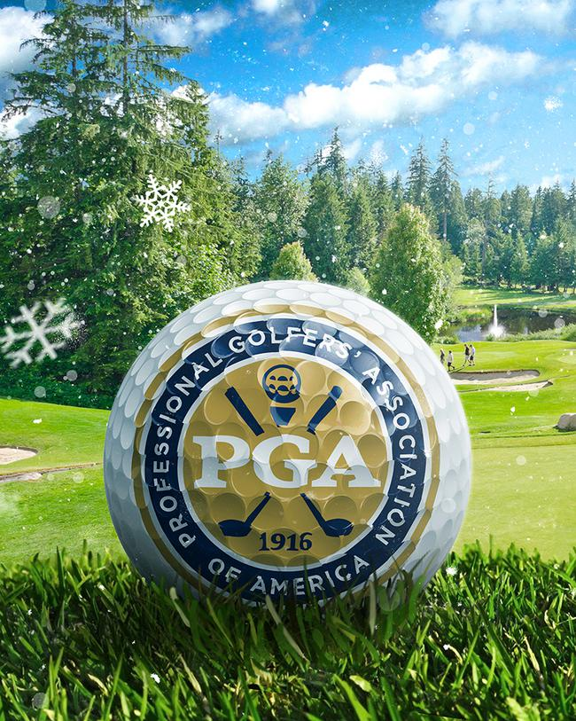
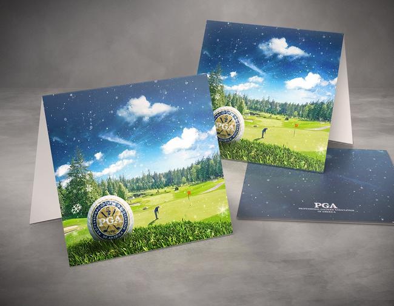
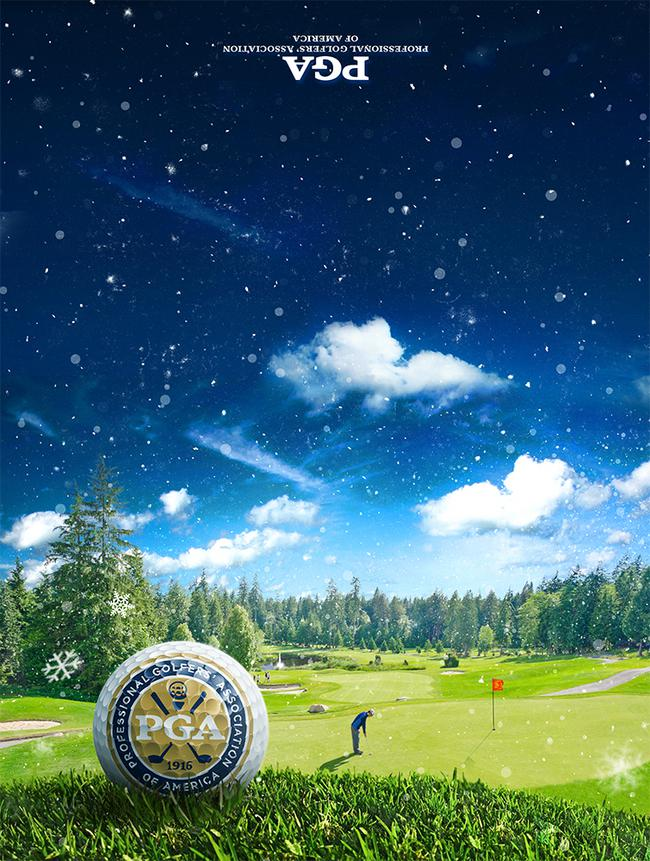
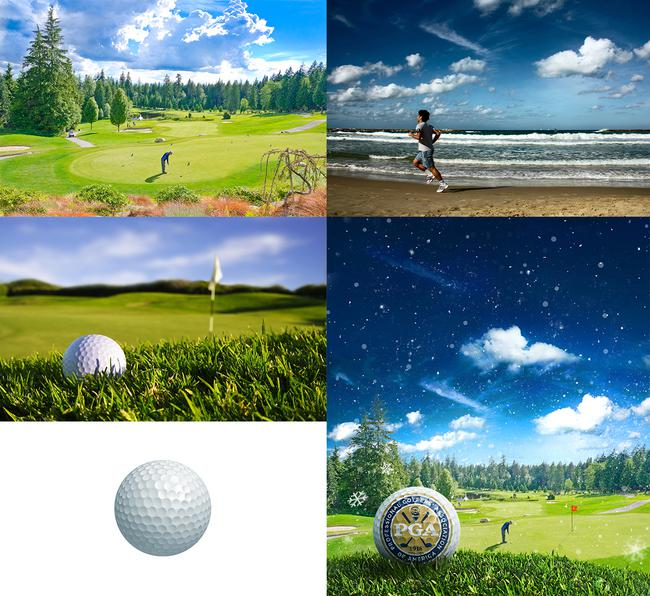

### About the PGA

The Professional Golfer’s Association of America is the largest sports organization in the world, comprised of more than 27,000 dedicated supporters promoting the game of golf to everyone, everywhere.

### Project Overview

Design a holiday card that captures the holiday spirit and the joy of playing golf. My concept was to show a golf scene under a light winter's snow. The holidays are a time to enjoy the things you love with the ones you love - in this case, playing golf (come rain or shine, or even snow...).

### Challenges

To fully capture the golf 'winter wonderland' scene that was pictured in my mind, a full photo composite was needed. Various elements were combined from 4 primary stock photos to create the final scene and mood. This also included realistically imposing the PGA logo onto a golf ball, intended for the main focal point. This was done using a displacement map, to warp and distort the logo around the contours of the golf ball dimples, along with lighting adjustments laid overtop of the logo, to preserve the detail of the surface shadows and highlights.

	<figure itemprop="associatedMedia" itemscope itemtype="http://schema.org/ImageObject" class="masonry-item project-gallery-item narrow">
		
		<figcaption itemprop="caption description">Closeup of PGA logo imposed on the surface of the golf ball</figcaption>
	</figure>
	<figure itemprop="associatedMedia" itemscope itemtype="http://schema.org/ImageObject" class="masonry-item project-gallery-item large">
		
		<figcaption itemprop="caption description"></figcaption>
	</figure>
	<figure itemprop="associatedMedia" itemscope itemtype="http://schema.org/ImageObject" class="masonry-item project-gallery-item large pga-card-design">
		
		<figcaption itemprop="caption description"></figcaption>
	</figure>
	<figure itemprop="associatedMedia" itemscope itemtype="http://schema.org/ImageObject" class="masonry-item project-gallery-item narrow">
		
		<figcaption itemprop="caption description"></figcaption>
	</figure>

	<figure class="masonry-item project-gallery-item project-gallery-video full">
		<iframe src="https://player.vimeo.com/video/137291395?color=2ECEF1&byline=0&portrait=0" id="pga-process" width="500" height="664" frameborder="0" webkitallowfullscreen mozallowfullscreen allowfullscreen></iframe>
	</figure>

